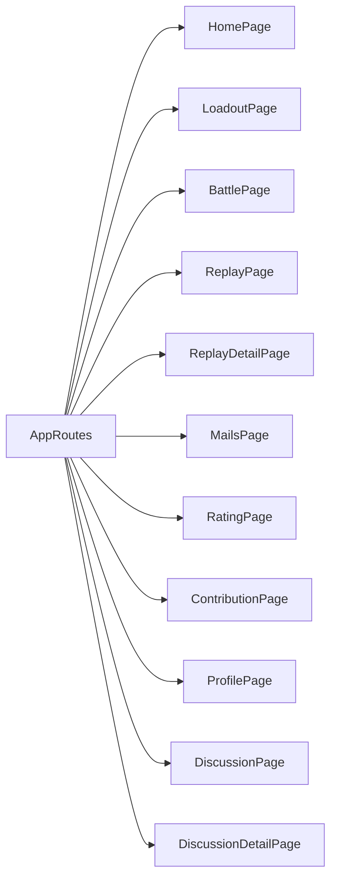
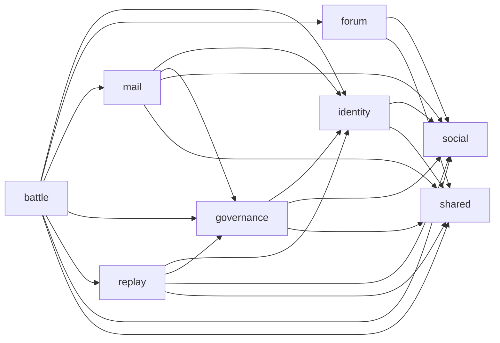
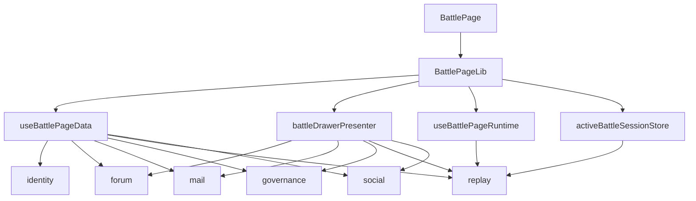

# Frontend Domain Page Import Structure

## 1. 扫描范围

本文件整理 `frontend/src/domains/**/pages/**/*.{ts,tsx}` 中的 page 级 import 关系，并额外展开 `battle/pages/battle/lib`。原因是 `BattlePage.tsx` 本身只 import 本域 lib，但这些 lib 承担了真实跨 domain 数据聚合。

不纳入统计：

- 第三方库：`react`、`react-router-dom` 等。
- 同 domain 内部 import：例如 `battle/pages/battle/lib/useBattlePageRuntime` 引用 `battle/runtime`。
- 非 page 层普通 runtime/component 之间的依赖，除非它们位于 page lib 下并直接服务 page。

当前前端 domain：

| Domain | 是否有 pages | 说明 |
| --- | --- | --- |
| `battle` | 是 | 配装页、战斗页，是当前跨域聚合最重的 domain。 |
| `forum` | 是 | 讨论列表和详情页。 |
| `governance` | 是 | 排行页、贡献页。 |
| `identity` | 是 | 玩家档案页。 |
| `mail` | 是 | 站内信页。 |
| `replay` | 是 | 回放列表和详情页。 |
| `social` | 否 | 没有 page，但被多个 page 引用为社交组件和好友请求能力。 |
| `bots` | 否 | 当前未被 page 直接引用。 |

## 2. App Routes 到 Page 的入口表

入口文件：`frontend/src/app/routes.tsx`

| Route | Page | Domain |
| --- | --- | --- |
| `/` | `HomePage` | `app` |
| `/loadout` | `LoadoutPage` | `battle` |
| `/battle` | `BattlePage` | `battle` |
| `/replay` | `ReplayPage` | `replay` |
| `/replay/:id` | `ReplayDetailPage` | `replay` |
| `/mails` | `MailsPage` | `mail` |
| `/rating` | `RatingPage` | `governance` |
| `/contribution` | `ContributionPage` | `governance` |
| `/profile/:handle` | `ProfilePage` | `identity` |
| `/discussion` | `DiscussionPage` | `forum` |
| `/discussion/:id` | `DiscussionDetailPage` | `forum` |

路由层本身是合理的组合根：它从各 domain 引入 Page，不代表 domain 之间互相依赖。

## 3. Domain Page 跨域 Import 表

| Page 或 Page Lib | Source Domain | Target Domain | 主要 import | 判断 |
| --- | --- | --- | --- | --- |
| `battle/pages/loadout/LoadoutPage.tsx` | `battle` | `identity` | `authGateway`, `AuthOverlay` | 配装页需要登录状态和登录弹窗，合理但应保持在页面组合层。 |
| `battle/pages/loadout/LoadoutPage.tsx` | `battle` | `forum` | `forumGateway` | 用于大厅讨论摘要，属于跨域聚合。 |
| `battle/pages/loadout/LoadoutPage.tsx` | `battle` | `mail` | `mailsGateway` | 用于大厅站内信摘要，属于跨域聚合。 |
| `battle/pages/loadout/LoadoutPage.tsx` | `battle` | `governance` | `ratingGateway` | 用于排行榜摘要，属于跨域聚合。 |
| `battle/pages/loadout/LoadoutPage.tsx` | `battle` | `replay` | `replayGateway` | 用于回放摘要，属于跨域聚合。 |
| `battle/pages/loadout/LoadoutPage.tsx` | `battle` | `social` | `friendRequestGateway`, `friendRequestPreviewPresenter` | 用于好友请求预览，属于跨域聚合。 |
| `battle/pages/loadout/LoadoutPage.tsx` | `battle` | `shared` | `LobbyShell`, `useLobbyData` | 共享 UI 依赖，合理。 |
| `battle/pages/battle/BattlePage.tsx` | `battle` | `shared` | `QuickPreviewOverlay` | 共享 UI 依赖，合理。 |
| `battle/pages/battle/lib/useBattlePageData.ts` | `battle` | `identity` | `authGateway` | 战斗页读取当前用户，合理但应通过 page data 层隔离。 |
| `battle/pages/battle/lib/useBattlePageData.ts` | `battle` | `forum` | `forumGateway` | 战斗页抽屉数据，属于跨域聚合。 |
| `battle/pages/battle/lib/useBattlePageData.ts` | `battle` | `mail` | `mailsGateway` | 战斗页抽屉数据，属于跨域聚合。 |
| `battle/pages/battle/lib/useBattlePageData.ts` | `battle` | `governance` | `ratingGateway` | 战斗页抽屉数据，属于跨域聚合。 |
| `battle/pages/battle/lib/useBattlePageData.ts` | `battle` | `replay` | `replayGateway` | 战斗页抽屉数据，属于跨域聚合。 |
| `battle/pages/battle/lib/useBattlePageData.ts` | `battle` | `social` | `friendRequestGateway`, `friendRequestPreviewPresenter` | 战斗页抽屉数据，属于跨域聚合。 |
| `battle/pages/battle/lib/battleDrawerPresenter.ts` | `battle` | `forum` | `forumGateway` 类型 | 抽屉 presenter 直接知道 forum 数据类型。 |
| `battle/pages/battle/lib/battleDrawerPresenter.ts` | `battle` | `mail` | `mailsGateway` | 抽屉会调用 mail read 操作，跨域副作用较强。 |
| `battle/pages/battle/lib/battleDrawerPresenter.ts` | `battle` | `governance` | `ratingGateway` 类型 | 抽屉 presenter 直接知道 rating 数据类型。 |
| `battle/pages/battle/lib/battleDrawerPresenter.ts` | `battle` | `replay` | `replayGateway` 类型 | 抽屉 presenter 直接知道 replay 数据类型。 |
| `battle/pages/battle/lib/battleDrawerPresenter.ts` | `battle` | `social` | `friendRequestPreviewPresenter` 类型 | 抽屉 presenter 直接知道 social 展示模型。 |
| `battle/pages/battle/lib/activeBattleSessionStore.ts` | `battle` | `replay` | `replayRecorder` | battle session 直接压缩 replay frame，属于 battle 和 replay 的强耦合点。 |
| `battle/pages/battle/lib/battlePageTypes.ts` | `battle` | `replay` | `replayTypes` | 页面状态类型引用 replay frame，属于可接受但需留意的类型耦合。 |
| `battle/pages/battle/lib/useBattlePageRuntime.ts` | `battle` | `replay` | `replayRecorder`, `replayTypes` | 战斗运行时直接生成 replay frame，是 battle -> replay 的业务依赖。 |
| `forum/pages/discussion-list/DiscussionPage.tsx` | `forum` | `social` | `UserActionDot` | 讨论页展示用户社交入口，合理。 |
| `forum/pages/discussion-list/DiscussionPage.tsx` | `forum` | `shared` | `ShellLayout` | 共享 UI 依赖，合理。 |
| `forum/pages/discussion-detail/DiscussionDetailPage.tsx` | `forum` | `social` | `UserActionDot` | 讨论详情展示用户社交入口，合理。 |
| `forum/pages/discussion-detail/DiscussionDetailPage.tsx` | `forum` | `shared` | `ShellLayout` | 共享 UI 依赖，合理。 |
| `governance/pages/rating/RatingPage.tsx` | `governance` | `identity` | `authGateway` | 排行页读取当前用户，合理。 |
| `governance/pages/rating/RatingPage.tsx` | `governance` | `social` | `UserActionDot` | 排行页展示用户社交入口，合理。 |
| `governance/pages/rating/RatingPage.tsx` | `governance` | `shared` | `ShellLayout`, `useLobbyData` | 共享 UI/大厅数据依赖，合理。 |
| `governance/pages/contribution/ContributionPage.tsx` | `governance` | `identity` | `authGateway` | 贡献页读取当前用户，合理。 |
| `governance/pages/contribution/ContributionPage.tsx` | `governance` | `social` | `UserActionDot` | 贡献页展示用户社交入口，合理。 |
| `governance/pages/contribution/ContributionPage.tsx` | `governance` | `shared` | `ShellLayout`, `useLobbyData` | 共享 UI/大厅数据依赖，合理。 |
| `identity/pages/profile/ProfilePage.tsx` | `identity` | `social` | `UserActionDot` | 个人档案展示社交入口，合理。 |
| `identity/pages/profile/ProfilePage.tsx` | `identity` | `shared` | `ShellLayout` | 共享 UI 依赖，合理。 |
| `mail/pages/inbox/MailsPage.tsx` | `mail` | `identity` | `authGateway` | 站内信需要当前用户和管理员判断，合理。 |
| `mail/pages/inbox/MailsPage.tsx` | `mail` | `governance` | `governanceGateway` | 邮件页处理治理通知，属于跨域业务耦合。 |
| `mail/pages/inbox/MailsPage.tsx` | `mail` | `social` | `friendRequestGateway`, `UserActionDot` | 邮件页处理社交通知和用户入口，合理但偏聚合。 |
| `mail/pages/inbox/MailsPage.tsx` | `mail` | `shared` | `ShellLayout` | 共享 UI 依赖，合理。 |
| `replay/pages/replay-list/ReplayPage.tsx` | `replay` | `identity` | `authGateway` | 回放列表读取当前用户，合理。 |
| `replay/pages/replay-list/ReplayPage.tsx` | `replay` | `governance` | `governanceGateway` | 回放页提交治理审核通知，属于跨域业务耦合。 |
| `replay/pages/replay-list/ReplayPage.tsx` | `replay` | `shared` | `ShellLayout` | 共享 UI 依赖，合理。 |
| `replay/pages/replay-detail/ReplayDetailPage.tsx` | `replay` | `identity` | `authGateway` | 回放详情读取当前用户，合理。 |
| `replay/pages/replay-detail/ReplayDetailPage.tsx` | `replay` | `governance` | `governanceGateway` | 回放详情提交治理审核通知，属于跨域业务耦合。 |
| `replay/pages/replay-detail/ReplayDetailPage.tsx` | `replay` | `social` | `UserActionDot` | 回放详情展示用户社交入口，合理。 |
| `replay/pages/replay-detail/ReplayDetailPage.tsx` | `replay` | `shared` | `ShellLayout` | 共享 UI 依赖，合理。 |

## 4. Battle Page 间接依赖展开

`BattlePage.tsx` 表面依赖较少：

```text
BattlePage.tsx
  -> ./lib/useBattlePageRuntime
  -> ./lib/battleDrawerPresenter
  -> BattleChrome
  -> QuickPreviewOverlay
```

但 `battle/pages/battle/lib` 内部承担了大量跨 domain 组合：

| Lib 文件 | 跨域依赖 | 职责 |
| --- | --- | --- |
| `useBattlePageData.ts` | `identity`, `forum`, `mail`, `governance`, `replay`, `social`, `shared` | 读取战斗页抽屉、当前用户、未读邮件、排行榜、回放、好友请求等页面辅助数据。 |
| `battleDrawerPresenter.ts` | `forum`, `mail`, `governance`, `replay`, `social`, `shared` | 把各 domain 摘要组装成战斗页快捷抽屉展示模型，并调用 `markMailAsReadRemote`。 |
| `useBattlePageRuntime.ts` | `replay` | 战斗运行时采样并生成 replay frame，同时处理 authoritative/local 运行时。 |
| `activeBattleSessionStore.ts` | `replay` | 存储 active battle session，并压缩 replay frames。 |
| `battlePageTypes.ts` | `replay` | 页面类型包含 `ReplayFrame`。 |

结论：`battle` 目前不仅是战斗 domain，也是首页/大厅/快捷预览聚合器。这个设计短期可用，但会让 battle page 对其它 domain 的数据结构和副作用越来越敏感。

## 5. Mermaid 关系图

### 5.1 App Route 到 Page



### 5.2 Domain Page 跨域依赖



### 5.3 聚合压力图



## 6. 架构问题和后续建议

| 问题 | 当前表现 | 风险 | 建议 |
| --- | --- | --- | --- |
| `battle` page 成为跨域聚合中心 | `LoadoutPage` 和 `BattlePage` lib 直接读取 forum/mail/governance/replay/social/identity | battle domain 逐渐承担大厅和社交门户职责，后续修改任一 domain 都可能影响战斗页 | 把跨域摘要读取沉到 `shared/ui/useLobbyData` 或独立 `app/home` 聚合层，battle 只消费聚合后的 view model。 |
| Page presenter 调用跨域副作用 | `battleDrawerPresenter.ts` 调用 `markMailAsReadRemote` | presenter 不再只是展示转换，出现远程副作用 | 把 read/mark 操作移动到 page data hook 或 mail domain gateway facade，presenter 只返回展示模型和 action id。 |
| Replay 与 Battle 双向概念接近 | battle runtime 生成 `ReplayFrame`，battle session store 压缩 replay frame | replay 类型渗透 battle page lib，后续 replay 格式变化会影响 battle runtime | 保留 battle -> replay 的单向生成关系，但通过 `BattleReplayRecordingPort` 隔离 replay 具体类型。 |
| 多个 page 直接引用 `UserActionDot` | forum/governance/identity/mail/replay 都 import social component | 当前是轻量 UI 复用，但 social 展示细节会扩散到所有页面 | 如果继续扩大，抽成 `shared/ui/UserHandleLink`，由 social 提供可选增强能力。 |
| 多个 page 直接引用 `authGateway` | battle/governance/identity/mail/replay 都读取身份状态 | auth 是横切能力，直接依赖可接受，但容易重复订阅逻辑 | 对页面统一暴露 `useCurrentAuthUser` 或 shared identity hook，减少每页手写 `useSyncExternalStore`。 |

## 7. 分层判断

可接受的依赖：

- Page 依赖本 domain 的 `api/objects/components/runtime`。
- Page 依赖 `shared/ui` 的布局和通用 UI。
- 业务页面展示用户入口时依赖 `social/components/UserActionDot`，当前规模下可接受。
- 需要当前用户的页面依赖 `identity/api/authGateway`，但建议后续用 hook 收敛。

需要收敛的依赖：

- `battle` page lib 直接依赖过多业务 domain。
- `battleDrawerPresenter.ts` 中出现 mail remote side effect。
- `mail` 和 `replay` 直接调用 `governanceGateway` 发送治理通知，说明 governance notification 是横切事件，适合抽出 notification port。
- `battle` 直接使用 replay recorder/types，建议通过 replay recording adapter 隔离。

优先级建议：

1. 先把 `battle/pages/battle/lib/battleDrawerPresenter.ts` 改成纯 presenter，不直接调用 `markMailAsReadRemote`。
2. 把 `useBattlePageData.ts` 和 `LoadoutPage.tsx` 里的大厅摘要读取合并到一个共享的 lobby data facade。
3. 为 replay 录制建立 battle 侧 port，避免 battle page lib 直接绑定 replay 文件结构。
4. 为 auth 状态建立统一 hook，减少 page 内重复订阅。
5. 后续如果做页面目录治理，保持所有 page 在 `domain/pages/<page-name>`，跨域组合尽量放在 `app` 或 `shared` 的明确聚合层。
